# Architecture

This document describes the deployed shape of `reverse_logger`: components,
network surfaces, data flows, storage, and correlation rules. It complements the
step-by-step runbooks in `docs/manual-deploy.md` and `docs/operations.md`.

## Contents

- [Scope](#scope)
- [System Overview](#system-overview)
- [Runtime Components](#runtime-components)
- [Deployment Topologies](#deployment-topologies)
- [Network Surfaces](#network-surfaces)
- [Central Logger HTTP API](#central-logger-http-api)
- [Data Flows](#data-flows)
- [Correlation Model](#correlation-model)
- [Storage Model](#storage-model)
- [Configuration Contract](#configuration-contract)
- [Trust Boundaries](#trust-boundaries)
- [Operational References](#operational-references)

## Scope

`reverse_logger` is an observability and deployment helper around an external
`reverse_ssh` listener. It does not implement the reverse shell transport
itself. It records lifecycle webhooks from `reverse_ssh`, captures VPS ingress
metadata, enriches sessions with real client IP data when possible, exposes a
read-only dashboard, and sends optional Telegram alerts.

The production host inventory, real domains, real IPs, credentials, VPN peer
state, and incident archives are intentionally out of scope for this repository.
Examples use documentation ranges such as `192.0.2.0/24` and must be replaced
per deployment.

## System Overview

The normal deployment has two planes:

- Data plane: generated `reverse_ssh` clients reach the VPS public HTTPS
  endpoint, then nginx proxies only the configured WSS or HTTPS polling paths to
  the internal main-server `reverse_ssh` listener.
- Observability plane: `reverse_ssh`, nginx edge helpers, health agents, and
  optional journal forwarders POST token-protected events to the central
  `rssh-logger`.

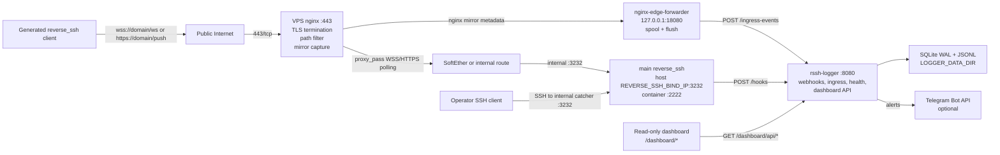

The main server does not need a SoftEther interface in the default topology. It
only needs an internal address that the VPS can reach through the prepared
SoftEther or private routing path.

## Runtime Components

| Component | Location | Executable or service | Role | Persistent state |
| --- | --- | --- | --- | --- |
| `reverse_ssh` | main server, Docker | external image from `REVERSE_SSH_IMAGE` | Accepts client callbacks and operator console sessions. Emits lifecycle webhooks to `rssh-logger`. | `REVERSE_SSH_DATA_DIR` |
| `rssh-logger` | main server, Docker | `cmd/rssh-logger` | Central HTTP receiver, SQLite/JSONL writer, correlation engine, dashboard API, edge-health evaluator, Telegram alert producer. | `LOGGER_DATA_DIR` |
| nginx edge | each VPS | nginx config from `deploy/nginx/` or Ansible template | Public TLS endpoint on `443/tcp`; routes only configured WSS/HTTPS polling/download paths to main `reverse_ssh`; mirrors ingress metadata locally. | nginx logs |
| `nginx-edge-forwarder` | each VPS | `cmd/nginx-edge-forwarder` | Receives nginx mirror subrequests on loopback, normalizes selected ingress events, spools them, and forwards them to main `/ingress-events`. | `/var/lib/reverse-logger/nginx-edge-spool` |
| `edge-health` | each VPS | `cmd/edge-health` | Periodically checks main `reverse_ssh`, logger health, optional VPN interface, and optional systemd services; POSTs health reports to main. | none beyond systemd logs |
| `rssh-error-forwarder` | main host or host with journal access | `cmd/rssh-error-forwarder` | Tails `reverse_ssh` logs, classifies failed attempts, and forwards selected events to main. | none |
| `edge-logger` | optional VPS fallback | `cmd/edge-logger` | User-space TCP proxy logger for non-nginx paths. Not part of the normal nginx WSS/HTTPS deployment. | local `edge_events.jsonl` and SQLite when used |
| dashboard | embedded in `rssh-logger` | `internal/loggerapp/dashboard_static/index.html` | Read-only browser UI for sessions, connection events, and VPS health. | central SQLite only |
| Telegram client | main `rssh-logger` | `internal/telegram` | Sends optional alerts for session transitions, failed attempts, and edge health transitions. | delivery marker tables in SQLite |

## Deployment Topologies

### Default WSS/HTTPS VPS Entrypoint

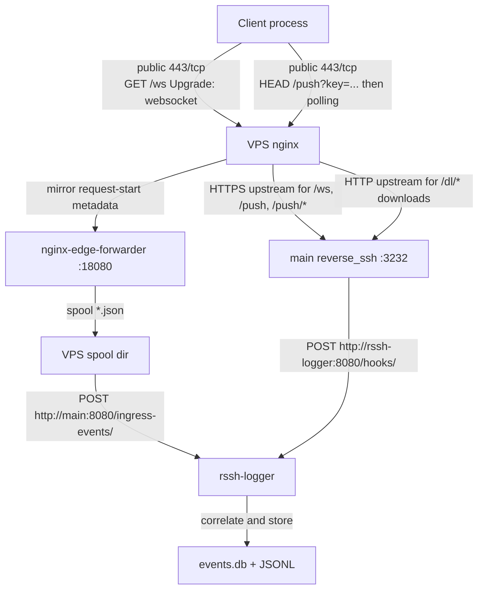

Use this topology when the public endpoint should look like a normal HTTPS site
and when you need real client ingress metadata in the central dashboard.

### Raw DNAT Fallback

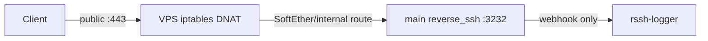

This path does not use nginx mirror capture. The webhook can still record
session lifecycle events, but real client IP quality depends on routing and
whether SNAT is required.

### Optional TCP Edge Logger

```mermaid
flowchart LR
    Client["Client"] -->|"TCP"| EdgeLogger["edge-logger proxy"]
    EdgeLogger -->|"TCP relay"| RSSH["main reverse_ssh"]
    EdgeLogger -->|"local InsertEdgeEvent"| LocalStore["VPS edge store"]
    EdgeLogger -. optional .->|"POST /edge-events/<token>"| Logger["rssh-logger"]
```

This is an alternative for non-nginx TCP proxy deployments. It is not used by
the normal nginx WSS/HTTPS path.

## Network Surfaces

| Surface | Location | Bind | Public | Auth | Consumer |
| --- | --- | --- | --- | --- | --- |
| Public HTTPS/WSS | VPS nginx | `0.0.0.0:443` | yes | `reverse_ssh` transport auth inside the proxied payload | generated clients |
| HTTP ACME bootstrap | VPS nginx | `0.0.0.0:80` | yes during HTTP-01 | none for ACME challenge path | Let's Encrypt HTTP-01 |
| Main `reverse_ssh` listener | main host Docker port publish | `REVERSE_SSH_BIND_IP:REVERSE_SSH_BIND_PORT` to container `:2222` | no | `reverse_ssh` operator/client auth | VPS nginx, operator console |
| Central logger | main host Docker port publish | `LOGGER_BIND_IP:LOGGER_BIND_PORT` to container `:8080` | no | path token or dashboard auth depending on endpoint | VPS forwarders, health agents, operators |
| Compose-internal logger | Docker network | `rssh-logger:8080` | no | path token for hooks | `reverse_ssh` container |
| Nginx mirror capture | VPS loopback | `127.0.0.1:18080` | no | loopback-only nginx internal caller | nginx `mirror` subrequest |
| Telegram Bot API | Internet egress from main or proxy | `api.telegram.org:443` by default | outbound only | bot token | `rssh-logger` |

Do not expose the central `/dashboard` or `/dashboard/api/*` routes through the
public VPS nginx entrypoint. Use `LOGGER_BIND_IP=127.0.0.1` plus SSH tunneling,
or bind to a private interface and firewall it to operator/VPS sources.

## Central Logger HTTP API

All write endpoints reject missing or empty tokens. Token mismatches return
`404` instead of `401` to avoid advertising active receivers.

| Endpoint | Method | Auth | Producer | Stored data |
| --- | --- | --- | --- | --- |
| `/healthz` | `GET` | none | health checks | no event state |
| `/hooks/<WEBHOOK_TOKEN>` | `POST` | path token | `reverse_ssh` webhook | `events`, `enriched_events`, `events.jsonl`, `enriched_events.jsonl` |
| `/ingress-events/<EDGE_FORWARD_TOKEN>` | `POST` | path token | `nginx-edge-forwarder` | `ingress_events`, `ingress_events.jsonl`, reconciliation updates |
| `/edge-events/<EDGE_FORWARD_TOKEN>` | `POST` | path token | optional `edge-logger` | `edge_events`, `edge_events.jsonl` |
| `/reverse-ssh-errors/<EDGE_FORWARD_TOKEN>` | `POST` | path token | `rssh-error-forwarder` | `reverse_ssh_errors`, `reverse_ssh_errors.jsonl` |
| `/edge/source-ip/<EDGE_FORWARD_TOKEN>` | `GET` | path token or `Authorization: Bearer` | VPS setup/Ansible | observed HTTP source IP, not persisted |
| `/edge-health/<EDGE_HEALTH_TOKEN>` | `POST` | path token or `Authorization: Bearer` | `edge-health` | `edge_health_reports`, `edge_health_state`, `edge_health_expected` |
| `/edge-health/expected[/<EDGE_HEALTH_TOKEN>]` | `PUT` | path token or `Authorization: Bearer` | deploy automation | expected VPS node registry |
| `/dashboard/` | `GET` | Basic Auth password `DASHBOARD_TOKEN` | browser | embedded UI |
| `/dashboard/api/overview` | `GET` | Basic or Bearer `DASHBOARD_TOKEN` | dashboard | aggregate session data |
| `/dashboard/api/events` | `GET` | Basic or Bearer `DASHBOARD_TOKEN` | dashboard | filtered enriched session rows |
| `/dashboard/api/system-events` | `GET` | Basic or Bearer `DASHBOARD_TOKEN` | dashboard | union of ingress and failed-attempt events |
| `/dashboard/api/edge-health` | `GET` | Basic or Bearer `DASHBOARD_TOKEN` | dashboard | effective VPS health state |
| `/dashboard/api/edge-health?vps_name=<name>` | `DELETE` | Basic or Bearer `DASHBOARD_TOKEN` | dashboard | removes current expected/state rows for one VPS health node |

## Data Flows

### WSS Client Connection

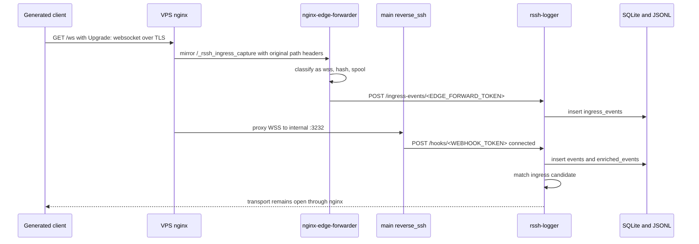

WSS ingress is captured at request start through nginx `mirror`. The nginx JSON
access log is diagnostic only because a WebSocket access log line is emitted
when the long-lived request closes.

### HTTPS Polling Client Connection

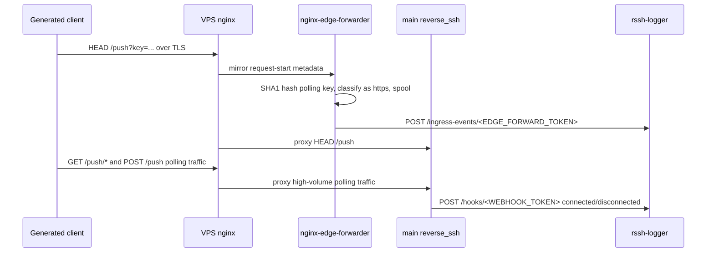

Only the HTTPS polling init request, `HEAD /push?key=...`, is stored as an
ingress event. Polling `GET /push/*` and `POST /push` are proxied but not
stored to avoid high-volume noise.

### Public Client Download

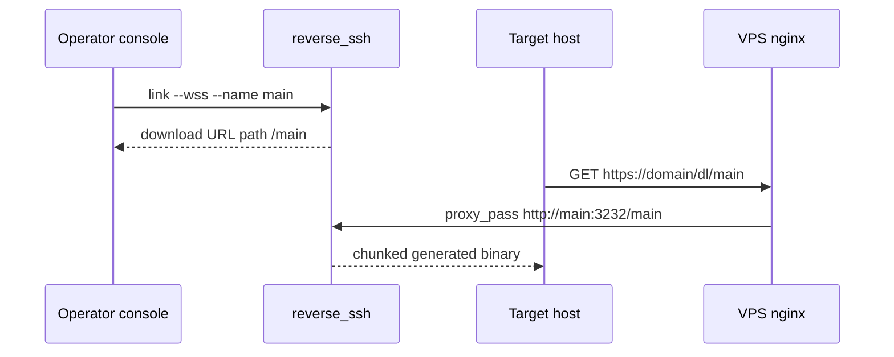

The public download prefix defaults to `/dl/`. It maps to backend `/` with a
trailing slash in `proxy_pass`, so `link --name main` becomes public
`/dl/main`. Downloads are proxied to the backend with plain HTTP even when WSS
and HTTPS polling locations use HTTPS upstreams.

### Webhook Normalization and Enrichment

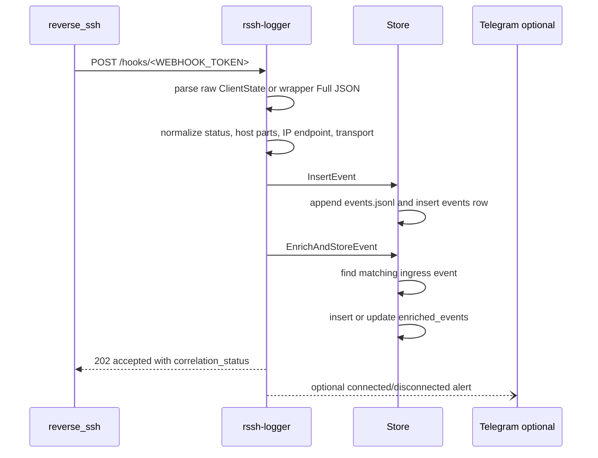

`HostName` is split once at the first dot. For `alice.workstation.lab`,
`user_name=alice` and `computer_name=workstation.lab`.

### Nginx Ingress Forwarding

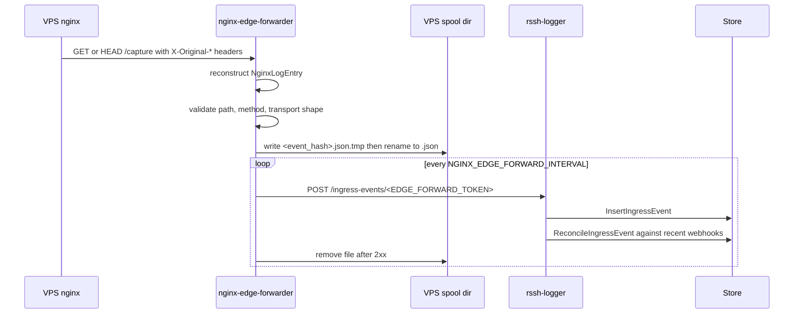

The spool makes forwarding resilient to short central logger outages. Duplicate
ingress payloads are deduped by `event_hash` in SQLite.

### Failed reverse_ssh Attempt Forwarding

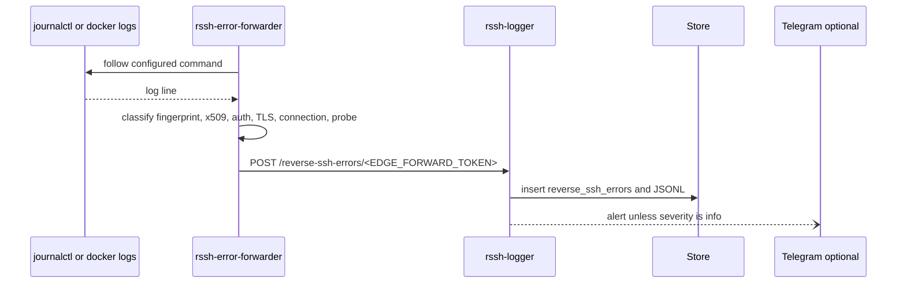

Malformed probes are classified as `info` and shown in the dashboard without
Telegram noise.

### Edge Health Reporting

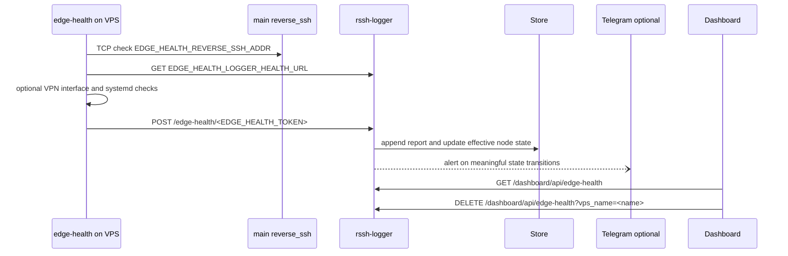

The central logger also runs a periodic evaluator. If a node stops reporting for
`interval_seconds * missed_reports`, its effective state becomes `down`.
Health reports auto-register the reporting VPS in `edge_health_expected`, so a
node removed from dashboard monitoring appears again if its `edge-health` agent
continues to report.

### Dashboard Reads

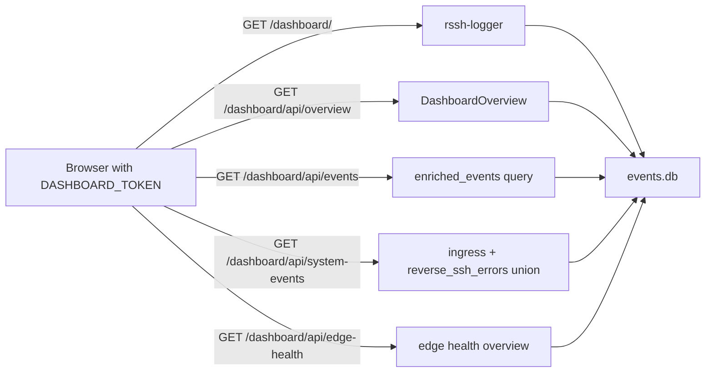

Dashboard pages are embedded in the `rssh-logger` binary and are available only
when `DASHBOARD_TOKEN` is non-empty.

## Correlation Model

The central logger maintains two raw sources and one enriched view:

- `events`: webhook lifecycle events from `reverse_ssh`.
- `ingress_events`: request-start metadata from VPS nginx.
- `enriched_events`: best-effort join of a webhook event to one ingress event.

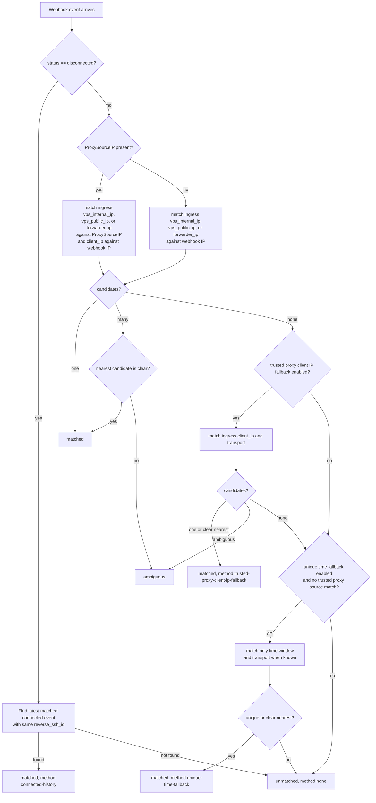

Important rules:

- Default webhook match window: `60s` before and `10s` after webhook time.
- HTTPS polling match window is widened to at least `5m` before and `1m` after.
- Default ingress reconcile window: `10s` before and `60s` after ingress time.
- HTTPS ingress reconcile window is widened to at least `1m` before and `5m`
  after.
- A nearest candidate is accepted only when it is within `15s` and at least
  `15s` closer than the second nearest candidate.
- Once an `enriched_events` row is matched, later weaker updates do not
  downgrade it to unmatched or a different ingress event.

Ingress events also trigger reverse reconciliation. When an ingress event
arrives after the webhook, `ReconcileIngressEvent` searches recent webhook rows
and refreshes their enriched rows.

## Storage Model

SQLite is the query store. JSONL files are durable append-only audit trails.
The store uses SQLite WAL mode, a single open connection, and unique
`event_hash` columns for dedupe.

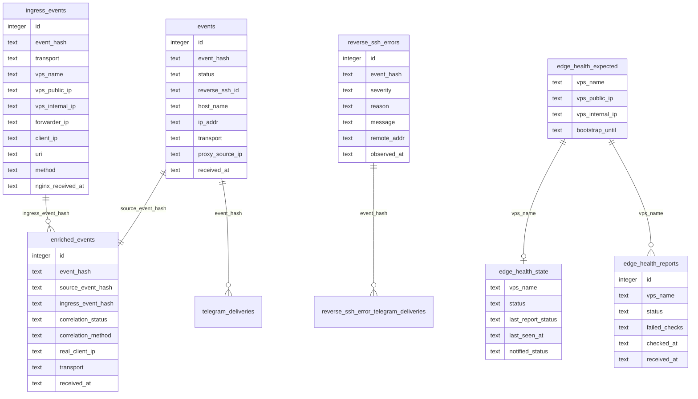

Central durable files under `LOGGER_DATA_DIR`:

| File | Purpose |
| --- | --- |
| `events.db` | SQLite query database and dedupe store |
| `events.jsonl` | raw normalized `reverse_ssh` webhook events |
| `ingress_events.jsonl` | raw normalized nginx ingress events |
| `enriched_events.jsonl` | webhook events enriched with ingress metadata |
| `reverse_ssh_errors.jsonl` | classified failed attempt events |
| `edge_events.jsonl` | optional TCP edge-logger events |

VPS durable or diagnostic files:

| File | Purpose |
| --- | --- |
| `/var/lib/reverse-logger/nginx-edge-spool/*.json` | unsent ingress events |
| `/var/lib/reverse-logger/nginx-edge-spool/nginx-edge.offset` | tail-mode log offset |
| `/var/log/nginx/reverse_ssh_ingress.json` | local nginx diagnostic access log |
| `/var/log/nginx/reverse_ssh_decoy.log` | decoy-path diagnostics |

## Configuration Contract

### Path Alignment

These values must describe the same public transport paths across the whole
stack:

| Layer | WSS path | HTTPS polling path | Download prefix |
| --- | --- | --- | --- |
| main `reverse_ssh` | `REVERSE_SSH_WS_PATH` | `REVERSE_SSH_PUSH_PATH` | `link --name` backend path |
| central logger validation | `INGRESS_WS_PATH` | `INGRESS_PUSH_PATH` | not validated |
| VPS forwarder | `RSSH_WS_PATH` | `RSSH_PUSH_PATH` | not parsed |
| VPS nginx | `location = /ws` and map | `location = /push` and map | `location ^~ /dl/` |
| generated clients | `link --ws-path` | `link --push-path` | public URL `/dl/<name>` |

For multiple edge groups, `INGRESS_WS_PATH` and `INGRESS_PUSH_PATH` may contain
comma-separated allowed paths. Paths must be absolute and should not end with a
trailing slash.

### Tokens

| Token | Used by | Protects |
| --- | --- | --- |
| `WEBHOOK_TOKEN` | `reverse_ssh` webhook registration | `/hooks` |
| `EDGE_FORWARD_TOKEN` | `nginx-edge-forwarder`, optional `edge-logger`, `rssh-error-forwarder` | `/ingress-events`, `/edge-events`, `/reverse-ssh-errors`, `/edge/source-ip` |
| `EDGE_HEALTH_TOKEN` | `edge-health` and expected-node registration | `/edge-health`, `/edge-health/expected` |
| `DASHBOARD_TOKEN` | browser/API clients | `/dashboard` and `/dashboard/api/*` |
| `TELEGRAM_BOT_TOKEN` | `rssh-logger` outbound alerts | Telegram Bot API |

Keep tokens only in `.env`, `/etc/reverse-logger/*.env`, a vault, or another
private runtime store. Do not commit real tokens.

### Important Timing Knobs

| Variable | Default | Purpose |
| --- | --- | --- |
| `CORRELATION_WEBHOOK_MATCH_BEFORE` | `60s` | How far before a webhook to search ingress candidates |
| `CORRELATION_WEBHOOK_MATCH_AFTER` | `10s` | How far after a webhook to search ingress candidates |
| `CORRELATION_INGRESS_RECONCILE_BEFORE` | `10s` | How far before ingress arrival to search webhooks |
| `CORRELATION_INGRESS_RECONCILE_AFTER` | `60s` | How far after ingress arrival to search webhooks |
| `CORRELATION_CLIENT_IP_FALLBACK_ENABLED` | `true` | Allows trusted-proxy client IP fallback |
| `CORRELATION_UNIQUE_TIME_FALLBACK_ENABLED` | `true` | Allows unique time-window fallback |
| `DASHBOARD_ACTIVE_SESSION_MAX_AGE` | `1h` | Hides stale active sessions with missing disconnects |
| `EDGE_HEALTH_DEFAULT_INTERVAL` | `30s` | Default expected report interval on central evaluation |
| `EDGE_HEALTH_MISSED_REPORTS` | `3` | Missed reports before a node becomes `down` |
| `EDGE_HEALTH_BOOTSTRAP_GRACE` | `2m` | Initial `unknown` grace for expected nodes |

HTTPS correlation internally widens the configured windows when needed because
polling init requests can arrive much earlier than the final lifecycle webhook.

## Trust Boundaries

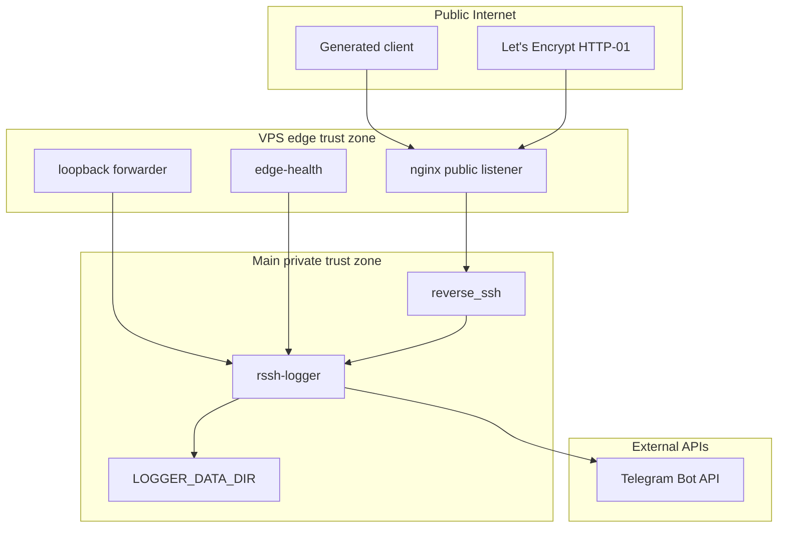

Security invariants:

- Public nginx exposes only `80/tcp` for ACME and `443/tcp` for decoy plus
  transport/download paths.
- The logger and dashboard are private services. They are not part of the
  public nginx route.
- Nginx overwrites `X-Real-IP` and `X-Forwarded-For` with `$remote_addr` before
  proxying to `reverse_ssh`. Do not use `$proxy_add_x_forwarded_for` on this
  path.
- When nginx is in front of `reverse_ssh`, set
  `REVERSE_SSH_TRUSTED_PROXY_CIDR` to the narrow source range that contains only
  trusted VPS nginx sources.
- `DASHBOARD_TOKEN` enables a read-only dashboard, but it is still sensitive
  because it exposes connection metadata.
- `EDGE_FORWARD_TOKEN` and `EDGE_HEALTH_TOKEN` should be separate so ingress
  forwarding and health reporting can be rotated independently.
- Real hostnames, IP allocations, VPN topology, DNAT state, and generated random
  paths belong in private operational state, not in this repository.

## Operational References

| Need | Document |
| --- | --- |
| Clean manual deployment | `docs/manual-deploy.md` |
| Day-2 health checks, backup, troubleshooting | `docs/operations.md` |
| VPS nginx WSS/HTTPS endpoint details | `docs/nginx-wss-https-entrypoint.md` |
| Webhook payloads and registration | `docs/reverse-ssh-webhook.md` |
| Raw DNAT and SoftEther notes | `docs/softether-entrypoint.md` |
| Telegram proxy and smoke tests | `docs/telegram-proxy.md` |
| Automated VPS rollout | `deploy/ansible/README.md` |
| Timeweb edge provisioning | `deploy/terraform/timeweb-edge/README.md` |
